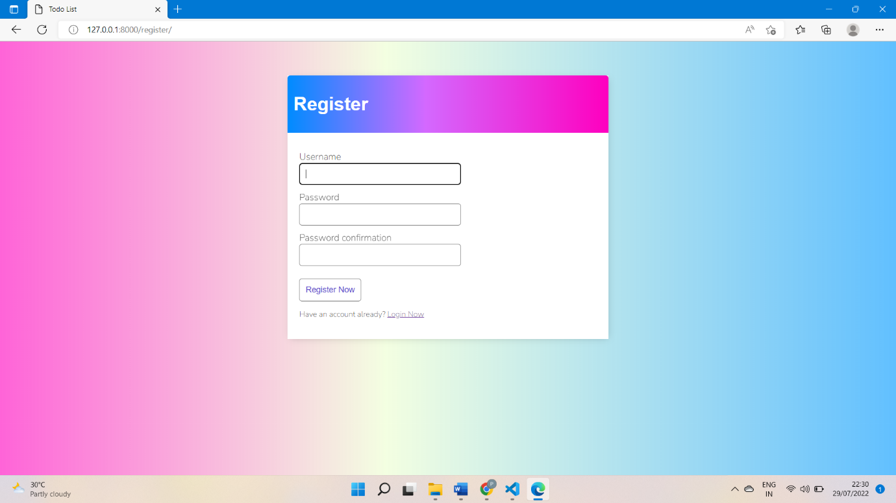
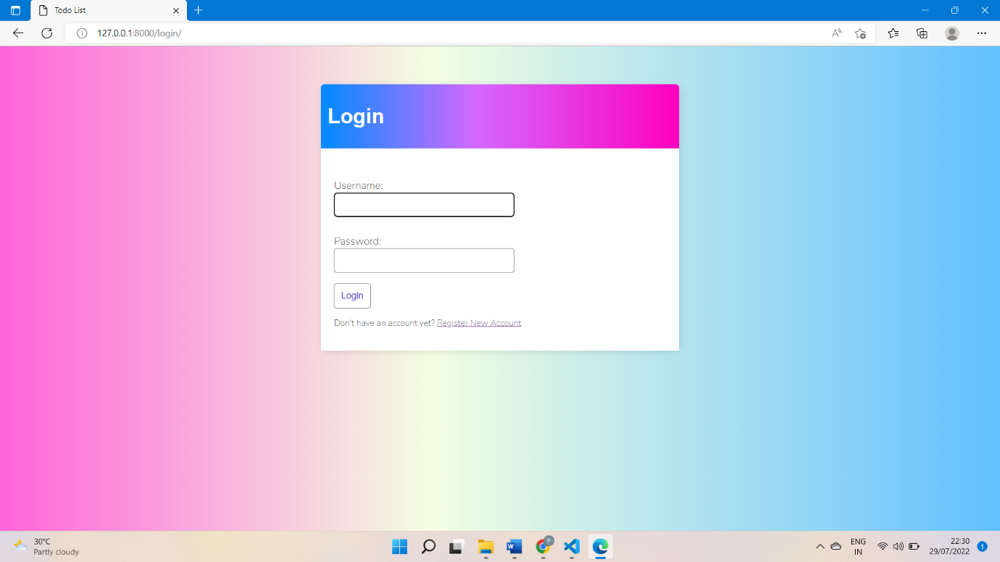
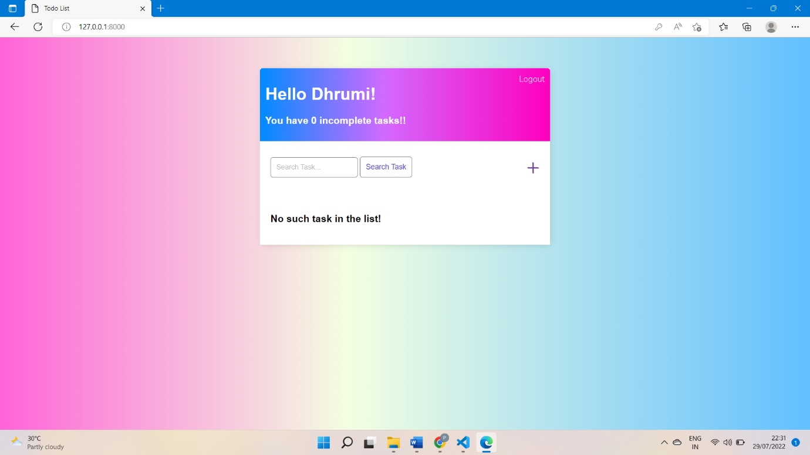
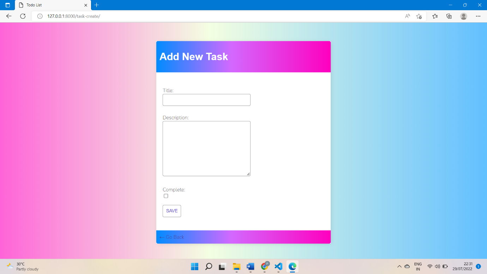
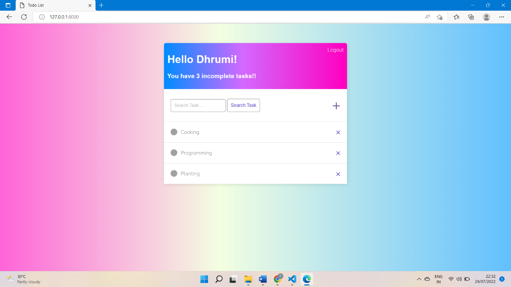
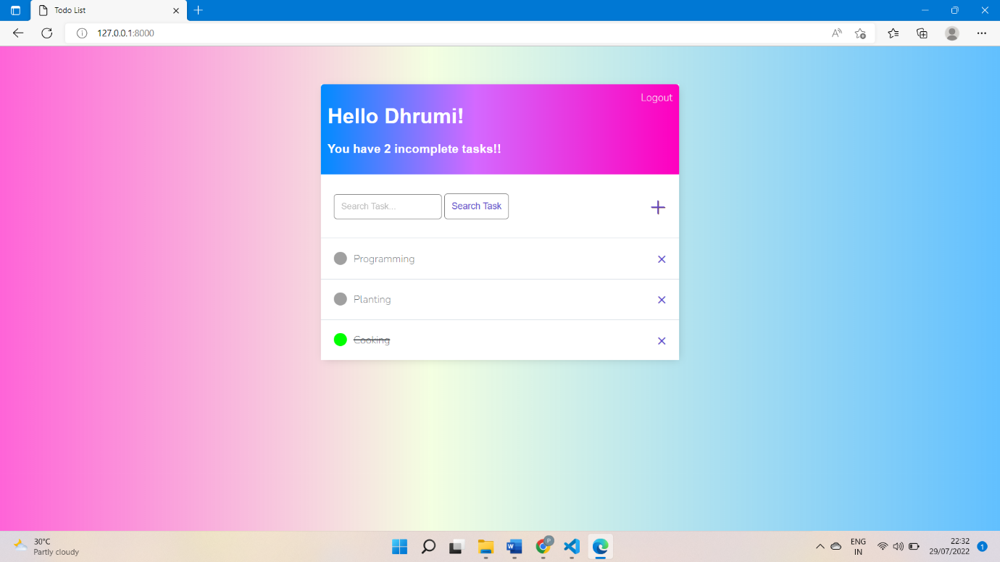
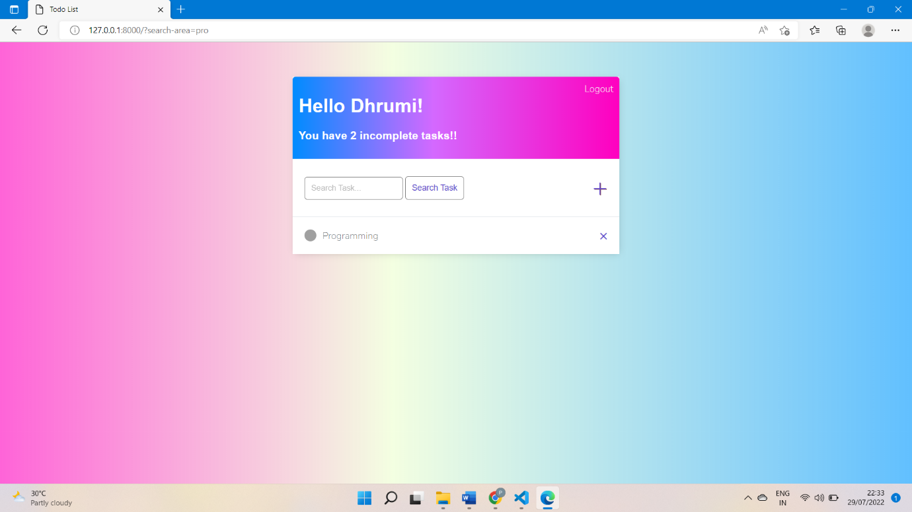
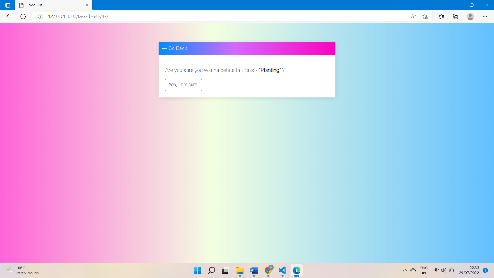
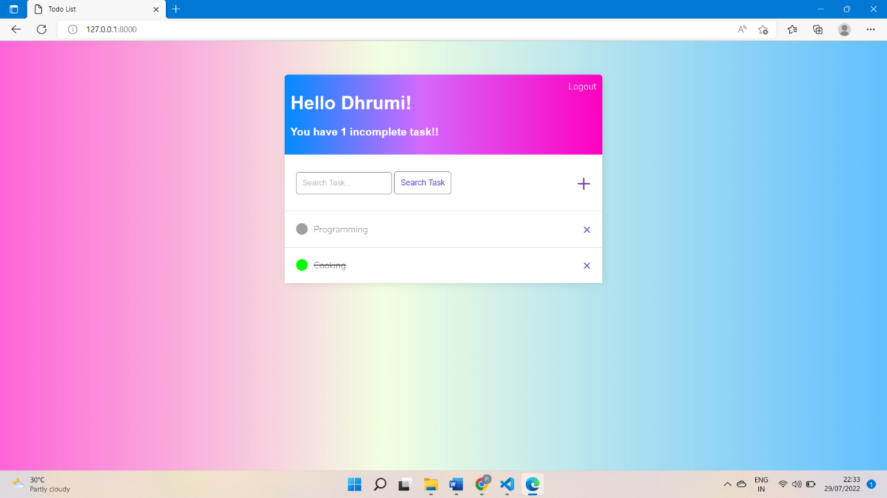

# 📋 ToDoList - The Productivity Companion

Welcome to **ToDoList**, a full-stack Django web application built to organize and manage tasks. Developed using **Python Django**, this project showcases my full-stack development skills in creating a responsive, secure, and user-friendly task manager.

## 🚀 Demo Video
🎥 Explore the complete workflow of how the application was developed and how it functions in real-time.

[Click to view the demo](https://www.linkedin.com/posts/dhrumiprajapati_python-django-programming-activity-6956984712506540032-BptQ?utm_source=share&utm_medium=member_desktop)

## 🏗️ Features
✅ Secure User Authentication (Sign Up, Login, Logout)  
✅ Add, Edit, Delete Tasks  
✅ Mark Tasks as Completed  
✅ Real-time Search Functionality  
✅ Task Completion Tracking (Counts Uncompleted Tasks)  
✅ Responsive UI with Bootstrap

## 🖥️ Technologies Used
- **Backend:** Python, Django
- **Frontend:** HTML5, CSS3, Bootstrap
- **Database:** SQLite (via Django ORM)
- **Version Control:** Git & GitHub
- **IDE:** Visual Studio Code

## Project Structure & Design
- Follows the **MVT (Model-View-Template)** architecture of Django.
- **Secure Authentication Flow:** Utilizes Django’s built-in auth system for user management.
- **Modular Design:** Clear separation of concerns across models, views, templates, and static files.
- **Custom Styling:** Bootstrap-enhanced styling and JavaScript validation for improved user experience.

## 📸 Output Snapshots

### Registration Page


### Login Page


### Home Dashboard


### Add New Task Page


### After Adding Tasks


### After Marking a Task as Completed


### Searching for a Task in the Search Bar


### Search Result: Relevant Task


### Searching Non-Existing Task


### Search Result: Task Not Found


### Delete Task Confirmation


### Task Deleted


## 📝 How to Run This Project Locally
```bash
# Clone the repository
git clone https://github.com/DhrumiPrajapati/TodoList.git
cd TodoList

# Create a virtual environment
python -m venv venv
source venv/bin/activate  # On Windows, use venv\Scripts\activate

# Run database migrations
python manage.py migrate

# Start the development server
python manage.py runserver
```

**Access the application at** `http://127.0.0.1:8000/`

## 📣 Final Thoughts

The ToDoList project is a testament to my commitment to clean code, user-centered design, and practical software engineering principles. It's a solid example of my full-stack development skills, and I’d love to discuss how I can bring this passion and expertise to your team!

## 🔔 Ready to explore more?
Let’s connect and talk about building impactful solutions together!
